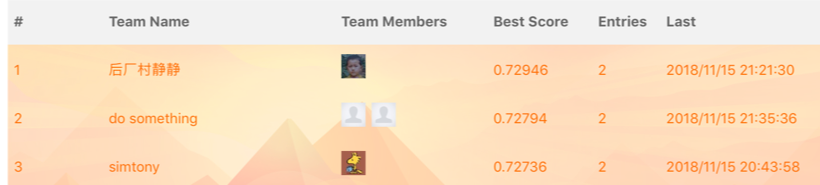

# Introduction
This repo contains code for [AI Challenger 2018](https://challenger.ai/competition/fsauor2018) aspect-level sentiment analysis. With proper tuning and ensemble, it achieves the third place in test B. 

I haven't include the ensemble part since it is clumsy. See the included presentation draft.

# How to run it
The code shall run under tensorflow-1.12. Make sure your machine has GPU.

Download data file from https://drive.google.com/file/d/1qaOW8FetbarRg42R8kgbsKTyuguHj0Xg/view?usp=sharing

Extract it into `data`

Then simply run

`python main.py --name <your_experiment_name>`

It shall read the contents in `data`. Logs and checkpoints will written in `output/<your_experiment_name>`。

You can change hyper-parameters in `configuration.py`.
